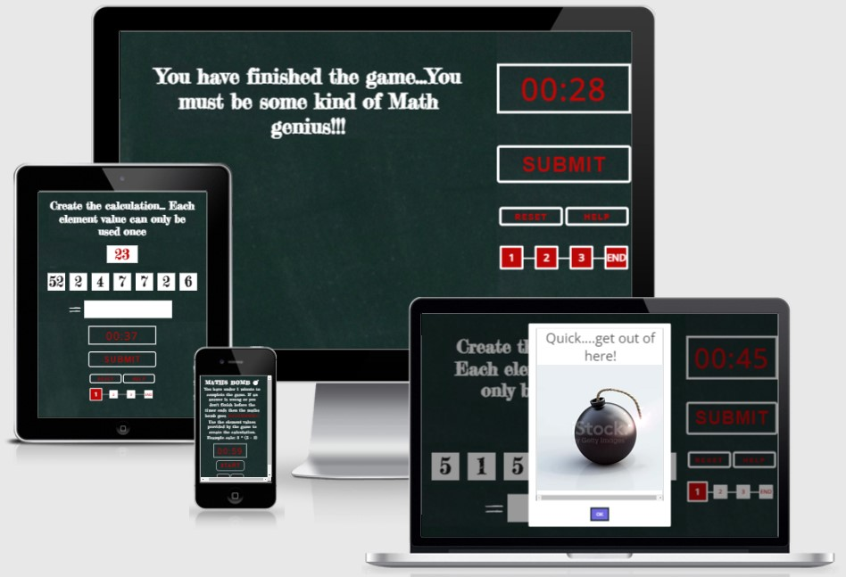

<h1 align="center">Maths Bomb</h1>

A game where the player has to answer three maths question correctly before the countdown timer elapses and the maths bomb explodes. Created as part of the Code Institue Portfolio 2: Javascript Essentials Milestone Project.

***

***

## Introduction

Nowadays people don't have to rely on their own ability to perform calculations that are not always necessarily difficult. Instead prefererring to use a phone or even a watch to calculate the cost of the electricity and gas bill combined.

The computer obviously gives the correct answer however people are not relying on their own ability to perform calculations. Over time this ability is reduced.

The brain is similiar to any other muscle in the body and if parts of it are not used, over time capacity is reduced. Playing games such as this for a few minutes each day is a way to maintain and train your brain.

***

## Table of Contents
* [Features](#Features)
* [Testing](#Testing)
* [Validator Testing](#validator-testing)
* [Technologies](#Technologies)
* [Deployment](#Deployment)
* [Issues List](#Issues-List)
* [Credits](#Credits)
***

## Features

### Landing Page
* The landing page gives the gamer an introduction on the rules of the game written in a chalk-style type font on a blackboard to give a education type setting.
* There is also a countdown timer and progress bar displayed.
* Smaller screen sizes displayed in column type layout.

***

### Game Playing
* When the start button is selected the introduction is replaced with randomly generated numbers that are to be used to create a calculation to compute a value that is also provided.
* The countdown timer displayed in digital clock type style starts counting down.

***

### Answer Correctly to Continue
* Enter a calculation that correctly computes the required value using the randomly generated numbers provided and the game continues to the next question. The progress bar increments to show the players progress.

***

### Answer Incorrectly or Timers Elapses
* If the calulation submitted does not equate the required value the bomb detonates.
* If the rules of the game are not followed the bomb detonates.
* If the countdown timer has elapsed the bomb detonates.

***

### Answer 3 Correctly in a Row
* There is three calculations to submit within the allowed time to complete the game.

***

### Each Screen Display
* Successful and unsuccessful attempts of the game.

***

## Testing
* Testing to confirm website functions and displays as expected using Google Chrome and Edge browsers. 
* Devtools device toolbar was used to confirm website is responsive and remains asthetically pleasing for the different standard screen sizes.
* Buttons, input elements, progress bar increment and countdown timer have all been tested to confirm everything functions as required.   
***

## Validator Testing
* HTML - no errors found when passing index.html, select-a-plan.html and signup.html content through the [W3C validator](https://validator.w3.org/nu/#textarea)

* CSS - no errors found when passing style.css content through the [Jigsaw validator](https://jigsaw.w3.org/css-validator/validator)

* JSHINT - no errors and 39 warnings found when passing script.js file through [jshint](https://jshint.com/). Warnings do not impact running of the game and are limitec to the following:
    * 	'let' is available in ES6 (use 'esversion: 6') or Mozilla JS extensions (use moz)
    * 	'template literal syntax' is only available in ES6 (use 'esversion: 6').

* Accessibility - Website accessibility is a key part of the project criteria. Devtools Lighthouse was used to confirm the colors and fonts used in each page are easy to read and accessible.

***

## Technologies Used
### Languages
* [HTML5](https://en.wikipedia.org/wiki/HTML5)
* [CSS](https://en.wikipedia.org/wiki/CSS)

### Libraries
* [Google Fonts](https://fonts.google.com/) - Import 'Fredericka the Great' and 'Open Sans'
* [Font Awesome](https://fontawesome.com/) - version 5.15.4

### Framework
* [GitHub](https://github.com/juliandunne1234/math-bombs) - Maths Bomb project repository
* [Gitpod](https://www.gitpod.io/) - open source developer platform used to create the website for the project
***

## Deployment
* The site was deployed to GitHub pages using the following steps: 
    * Open the GitHub repository and select Settings tab
    * Select Master Branch from the source section drop down menu
    * Live link - [Maths Bomb](https://juliandunne1234.github.io/math-bombs/)
***

## Issues List
* Open Issues:
    * Setting relative and absolute positioning on each web page so that the full screen size is used by the page. Instead there is whitespace remaining at the bottom of the pages.
  
* Resolved Issues:
    * Stopping the timer at 00.00 seconds
    * Maintaining the timer format 00.09 once the timer was below 10 seconds
    * Accessing the values entered by the user to create the calculation and not including operators inputted as part of the calculation
    * Creating a game that even if the player knows the formula to calculate the answer, that becuase of the added randomness the game maintains a moderate level of difficulty
***

## Credits
### Content

* The Love Maths walkthrough project with Code Institute was very helpful to use as a starting point for this project.
* Tutor support was also very helpful and advice taken from mentor sessions was used during development of the website
* The progress bar was created with help using a Udemy course
    * 50 Projects in 50 Days - HTML, CSS, Javascript: Section 3 - Progress Steps
* Setting up the countdown timer using setInterval and configuring the timer so that the format was maintained when the timer was less than 10 seconds was got from the following YouTube video: [Coding Challenge #6](https://www.youtube.com/watch?v=MLtAMg9_Svw&t=1055s)

### Media
* All images and the video used in this project were found on the [pexels](https://www.pexels.com/) website
* Fonts used were imported from [Google Fonts](https://fonts.google.com/)
* Gym dumbell icon used throughout the website is taken from [Font Awesome](https://fontawesome.com/)
***