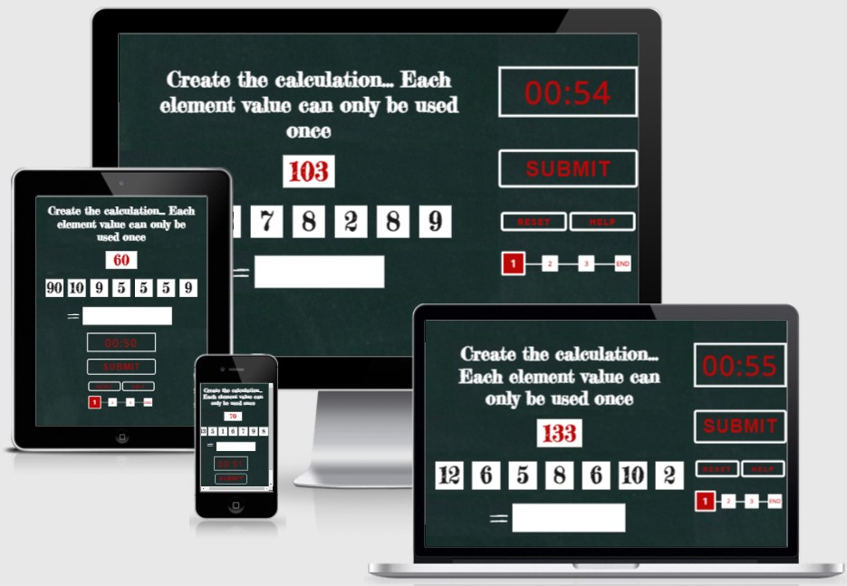

<h1 align="center">Maths Bomb</h1>
A game where the player has to answer three maths question correctly before the countdown timer elapses and the maths bomb explodes. Created as part of the Code Institue Portfolio 2: Javascript Essentials Milestone Project.

***

***

## Introduction
Nowadays people don't have to rely on their own ability to perform calculations that are not always necessarily difficult. Instead prefererring to use a phone or even a watch to calculate the cost of the electricity and gas bill combined.

The computer obviously gives the correct answer however people are not relying on their own ability to perform calculations. Over time this ability is reduced. 

The brain is similiar to any other muscle in the body and if parts of it are not used, over time capacity is reduced. Playing games such as this for a few minutes each day is a way to maintain and train your brain.
***

## Table of Contents
* [Features](#Features)
* [Testing](#Testing)
* [Validator Testing](#validator-testing)
* [Technologies](#Technologies)
* [Deployment](#Deployment)
* [Issues List](#Issues-List)
* [Credits](#Credits)
***

## Features

### Landing Page
* The landing page gives the gamer an introduction on the rules of the game written in a chalk-style type font on a blackboard to give a education type setting.
* There is also a countdown timer and progress bar displayed.
* Smaller screen sizes displayed in column type layout.

***

### Game Playing
* When the start button is selected the introduction is replaced with randomly generated numbers that are to be used to create a calculation to compute a value that is also provided.
* The countdown timer displayed in digital clock type style starts counting down.

***

### Answer Correctly to Continue
* Enter a calculation that correctly computes the required value using the randomly generated numbers provided and the game continues to the next question. The progress bar increments to show the players progress.

***

### Answer Incorrectly or Timers Elapses
* If the calulation submitted does not equate the required value the bomb detonates.
* If the rules of the game are not followed the bomb detonates.
* If the countdown timer has elapsed the bomb detonates.

***

### Answer 3 Correctly in a Row
* There is three calculations to submit within the allowed time to complete the game.

***

### Each Screen Display
* Successful and unsuccessful attempts of the game.

***